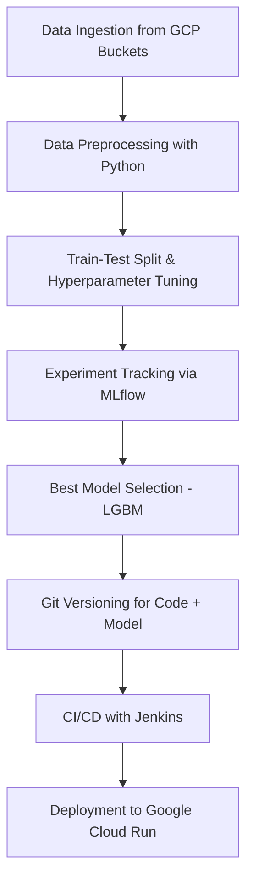

# 📦 BookingFlow AI

BookingFlow AI is an end-to-end **Hotel Reservation Prediction System** built with a complete **MLOps pipeline**, designed to help booking platforms (web or app) prevent losses due to no-shows and cancellations by intelligently forecasting reservation behavior using machine learning.

---

## 🚀 Model Metrics 

> 📊
> 
> 

---

## 📌 Problem Statement

Many booking platforms and hotel businesses face significant revenue loss due to last-minute cancellations or no-shows. This project aims to predict whether a customer will cancel their hotel reservation based on historical and contextual data — empowering platforms to optimize overbooking strategies, send proactive reminders, or secure prepayments.

---

## 🧠 Key Features

- Predict customer reservation cancellations
- Built with **scalable and reproducible MLOps practices**
- Supports integration into existing **booking sites/apps**
- Lightweight model for fast inference
- Full CI/CD with automated deployment on **Google Cloud Run**

---

## 🛠️ Tools & Technologies Used

| Task | Tools / Services |
|------|------------------|
| Data Setup & Storage | **Google Cloud Storage (GCP Buckets)** |
| Data Preprocessing | `pandas`, `numpy`, `sklearn`, `matplotlib`, `seaborn` |
| Model Training | `Jupyter Notebook`, `scikit-learn`, `XGBoost`, `LightGBM` |
| Experiment Tracking | **MLflow** |
| Model Evaluation | Accuracy, F1-score, ROC-AUC |
| Model Deployment | **Jenkins**, **Google Cloud Run**, Docker |
| Code & Data Versioning | **Git**, `.dvc` *(optional)* |
| CI/CD | **Jenkins pipelines**, GitHub/GitLab CI *(configurable)* |

---

## 🤖 Models Trained

The following machine learning classifiers were trained and evaluated using MLflow:

- ✅ Random Forest *(Best Accuracy, but too large for CI/CD workflows)*
- ✅ **LightGBM** *(Chosen Model: good balance of accuracy + model size)*
- Logistic Regression
- Gradient Boosting Classifier
- Support Vector Machine (SVC)
- Decision Tree
- K-Nearest Neighbors
- Naive Bayes
- XGBoost
- AdaBoost

> 🏆 Final choice: **LightGBM**, due to:
> - Competitive performance
> - Lower memory footprint
> - Seamless model versioning in Git

---

## 🔄 MLOps Pipeline Overview


---

## 📂 Folder Structure
```
BookingFlow-AI/
│
├── data/                  # Processed and raw data
├── notebooks/             # Jupyter Notebooks for EDA and training
├── models/                # Saved ML models
├── mlruns/                # MLflow tracking files
├── jenkins/               # Jenkins pipeline configs
├── src/                   # Source scripts (preprocessing, training, etc.)
├── Dockerfile             # For containerized deployment
├── requirements.txt       # Python dependencies
└── README.md              # This file
```
---

## 🚦 CI/CD & Deployment

1. J enkins automates the model training and deployment pipeline
2. Containerized with Docker and deployed via Google Cloud Run
3. Webhook triggers on Git commits to redeploy the latest model
4. Supports rollback and testing through Jenkins jobs

---

## 📌 Future Enhancements

1. Add deep learning models (e.g., TabNet)
2. Connect live booking APIs for real-time training
3. Integrate alerting/notification system for flagged reservations
4. Streamlit or ReactJS frontend for user-facing insights

---

## ✨ Credits
```
Made with ❤️ by Sri Rumde
ML Engineer | Generative AI Enthusiast | 2× Hackathon Winner
```
